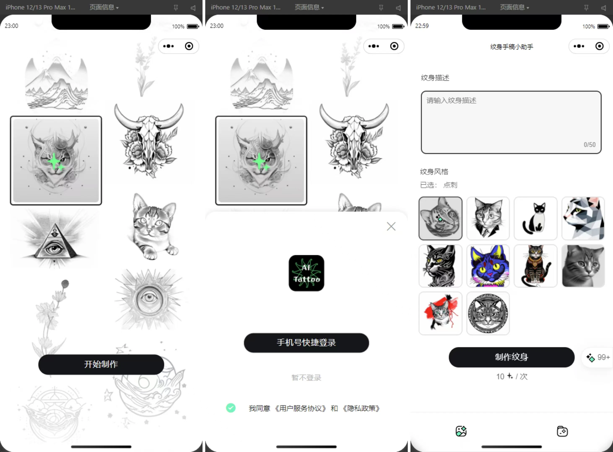
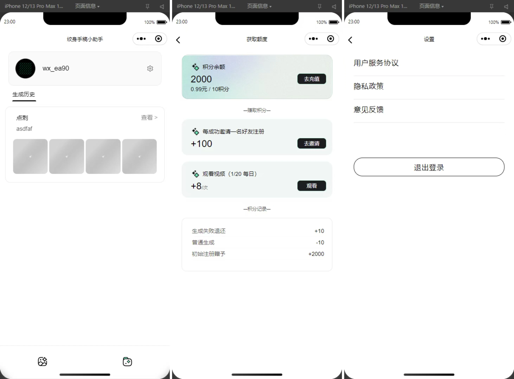
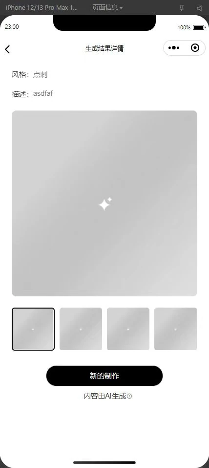

# Xiaowen AI Tattoo Pattern Generation Mini Program

Language: [中文](./README.md) | English

> Tags: WeChat Mini Program, AI Tattoo Design, Tattoo Pattern Generation, Multiple Styles, Text-to-Image

Xiaowen AI — An AI-based tattoo pattern generation mini program.

Describe the tattoo you have in mind, choose a style, and let AI turn your idea into artwork. Explore dotwork, blackwork, minimalist, geometric, Japanese and other tattoo styles, view your results, revisit previous designs, and invite friends to earn more generation credits.

## 1. Main Features

- User login and registration
- Generation credits and credit history
- Multiple tattoo styles: dotwork, blackwork, minimalist, geometric, old school, new school, Japanese, realism, trash polka and tribal
- Artwork previews and generation history
- Invite friends to earn generation credits

### Login and Home Screens



### My Page, Credits and Settings



### Tattoo Generation Results



## 2. Project Components

The components of Xiaowen AI are maintained together in this repository:

- [WeChat mini program](./wechat-miniprogram/): Log in, choose styles, generate artwork and view your designs.
- [Backend](./backend/): Users, generation credits, artwork history and generation tasks.
- [Management frontend](./admin/): Management and generation pages.
- [Tattoo style training assets](./sd-model/): Stable Diffusion documentation and LoRA training data.

System structure diagram:


## 3. Quick Start

Install dependencies and start development inside the mini program directory:

```bash
cd wechat-miniprogram
npm install
npm run dev:weapp
```

Open `wechat-miniprogram/` in WeChat Developer Tools. Set `BACKEND_URL` in `src/constant/Urls.ts` to your backend address.

See the [development guide](./docs/development-en.md) for environment configuration and instructions for each component.
