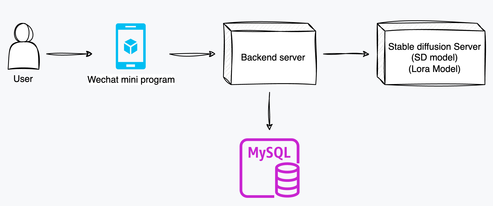

# xiaowen-wechat-miniprogram 小纹AI纹身图案生成小程序

Language: 中文 | [English](./README-en.md)

> 标签：微信小程序、Taro、Stable diffusion、纹身图案生成、AIGC、文生图

小纹AI — 基于AI的纹身图案生成小程序。

一个基于 Taro 的微信小程序项目。借助 Stable diffusion
实现了生成纹身图案的功能。提供了若干种风格的纹身图案生成。

## 1. 主要功能

- 基础的用户登录、注册
- 用户生成额度系统
- 多种纹身图案风格选择（点刺、纯黑、小清新、几何线条、传统美式、新传统美式、日式、动漫、写实、超现实、图腾）

### 登录页面及主页


### 我的页面/积分额度页面/设置页面


### 纹身图案生成页面


## 2. 关联项目

- [xiaowen-backend](https://github.com/VeejaLiu/xiaowen-backend)：后端项目
- [xiaowen-BMC](https://github.com/VeejaLiu/xiaowen-BMC)：后台管理前端项目
- [xiaowen-generate-server](https://github.com/VeejaLiu/xiaowen-generate-server)
  ：Stable diffusion 相关资源（模型、数据集等）

系统结构示意图：


## 3. 快速启动项目

版本推荐：

```
"node": "18.12.1",
"npm": "8.19.2"
```

安装依赖：

```bash
npm install
```

运行脚本 'dev:weapp' 启动项目。

```
npm run dev:weapp
```

在微信开发者工具中打开该项目目录，即可看到效果。


> **需要额外修改的地方：**
> 1. src/constant/Urls.ts 中的 BASE_URL 需要修改为自己的后端服务地址。
> 2. 修改 project.private.config.json 中的 setting.urlCheck 为
     false。或者在微信开发者工具中关闭服务端校验域名。
