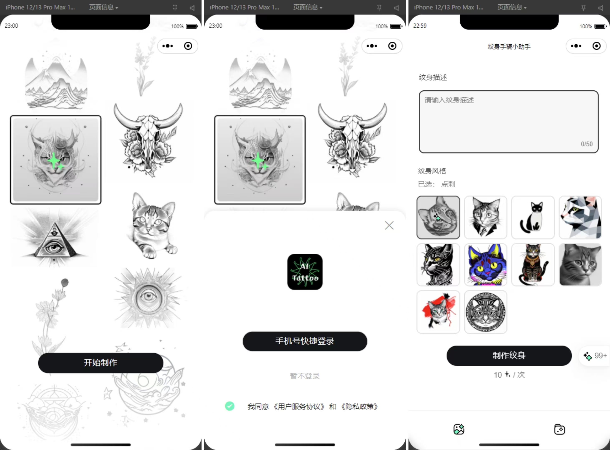
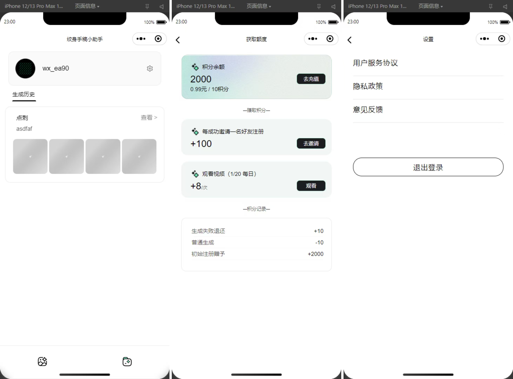
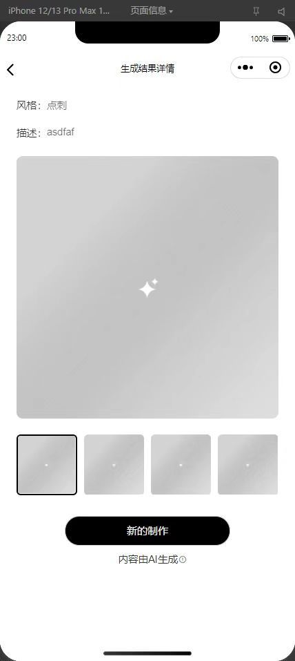

# 小纹 AI 纹身图案生成小程序

Language: 中文 | [English](./README-en.md)

> 标签：微信小程序、AI 纹身、纹身图案生成、多种风格、文生图

小纹 AI — 基于 AI 的纹身图案生成小程序。

输入你想要的纹身描述，选择喜欢的风格，让 AI 帮你把想法变成图案。小纹 AI 提供点刺、纯黑、小清新、几何、日式等多种纹身风格，你可以查看生成结果、回顾历史作品，也可以通过邀请好友获得更多生成额度。

## 1. 主要功能

- 用户登录、注册
- 用户生成额度与积分记录
- 多种纹身图案风格选择（点刺、纯黑、小清新、几何线条、传统美式、新传统美式、日式、写实、垃圾波尔卡、图腾）
- 生成结果预览与历史作品回顾
- 邀请好友获取额度

### 登录页面及主页



### 我的页面/积分额度页面/设置页面



### 纹身图案生成页面



## 2. 项目组成

小纹 AI 的几个组成部分统一维护在本仓库：

- [微信小程序](./wechat-miniprogram/)：用户登录、选择风格、生成图案和查看作品。
- [业务后端](./backend/)：用户、生成额度、作品记录和生成任务。
- [管理前端](./admin/)：管理与生成操作页面。
- [纹身风格训练素材](./sd-model/)：Stable Diffusion 相关说明和 LoRA 训练数据。

系统结构示意图：


## 3. 快速启动项目

在小程序目录中安装依赖并启动开发：

```bash
cd wechat-miniprogram
npm install
npm run dev:weapp
```

在微信开发者工具中打开 `wechat-miniprogram/` 子目录，即可查看小程序。将 `src/constant/Urls.ts` 中的 `BACKEND_URL` 设置为自己的后端地址。

完整的环境配置和各模块启动方式见 [开发文档](./docs/development.md)。
