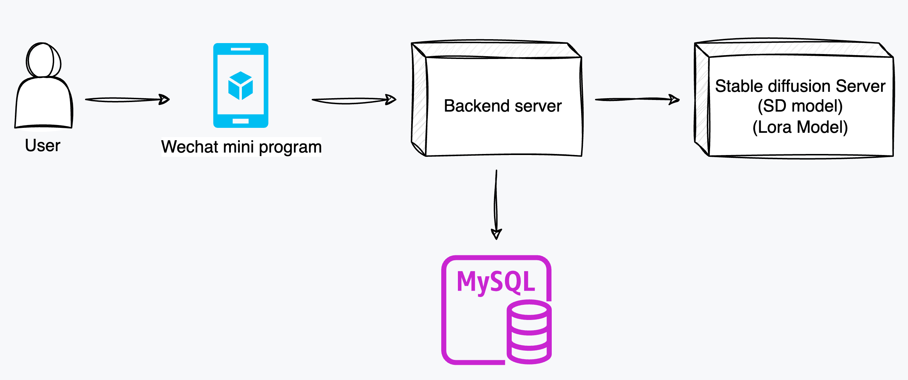

# 小纹 AI

Language: 中文 | [English](./README-en.md)

小纹 AI 是一个通过文字描述和风格选择生成纹身图案的项目。微信小程序、业务后端、管理前端和 Stable Diffusion 训练素材现在统一维护在本仓库，仓库名称继续使用 `xiaowen-wechat-miniprogram`。

## 目录结构

| 目录 | 内容 | 技术栈 |
| --- | --- | --- |
| [wechat-miniprogram/](./wechat-miniprogram/) | 微信小程序：登录、生成、历史记录、积分及邀请 | Taro 3、Vue 3、NutUI 4 |
| [backend/](./backend/) | 业务接口、用户与积分、生成任务队列、图片存储及微信通知 | Express、TypeScript、Sequelize、MySQL、MinIO |
| [admin/](./admin/) | 管理前端及生成、历史记录页面 | React 18、Vite、Ant Design |
| [sd-model/](./sd-model/) | Stable Diffusion 相关说明、LoRA 训练图片、标注及缓存 | 训练素材 |

各应用保留自己的 `package.json`、锁文件和配置，依赖分别安装。根目录的脚本只是转发命令，并在对应应用目录中执行。

## 系统结构

微信小程序和管理前端访问 `backend/` 提供的业务接口。后端连接 MySQL、MinIO、微信接口及单独运行的 Stable Diffusion 服务。



`sd-model/` 当前收录的是训练素材和说明，运行中的 Stable Diffusion 服务及所需模型权重需要单独准备。

## 开发启动

### 微信小程序

原项目声明的环境为 Node.js `18.12.1`、npm `8.19.2`。在子目录中安装依赖：

```bash
cd wechat-miniprogram
npm install
npm run dev:weapp
```

在微信开发者工具中打开 **`wechat-miniprogram/` 子目录**，构建产物位于 `wechat-miniprogram/dist/`。

在 [wechat-miniprogram/src/constant/Urls.ts](./wechat-miniprogram/src/constant/Urls.ts) 中设置 `BACKEND_URL`。当前值为 `http://localhost:10100`；真机调试需要设备可访问的地址。开发时的域名校验配置仍位于该子目录的 `project.private.config.json`。

详细说明：[小程序 README](./wechat-miniprogram/README.md)。

### 业务后端

原项目声明的环境为 Node.js `18.20.3`、npm `10.7.0`。

```bash
cd backend
cp .env.test .env
# 修改 .env，填写自己的服务地址和凭据
npm ci
npm run start
```

初始化数据库时参考 [backend/sql_init/database.sql](./backend/sql_init/database.sql)。配置文件包含 MySQL、MinIO、微信、百度翻译、JWT 及 `GENERATE_SERVER_URL` 等配置。`.env.test` 是示例配置，实际凭据仅放在被 Git 忽略的 `.env` 中。

详细说明：[后端 README](./backend/README.md)。

### 管理前端

```bash
cd admin
npm ci
npm run dev
```

在 [admin/src/service/config.ts](./admin/src/service/config.ts) 中修改 `backendUrl`，指向自己的业务后端。

详细说明：[管理前端 README](./admin/README.md)。

### 从仓库根目录执行

各应用安装依赖后，可以从根目录使用这些命令：

```bash
npm run dev:weapp
npm run build:weapp
npm run dev:h5
npm run start:backend
npm run dev:admin
npm run build:admin
```

## 仓库迁移

原 `xiaowen-backend`、`xiaowen-BMC` 和 `xiaowen-sd-model` 的默认分支及 Git 提交历史已导入对应子目录。旧名称 `xiaowen-generate-server` 已重定向到 `xiaowen-sd-model`。

旧仓库归档后继续保留历史记录，后续开发统一在本仓库进行。历史分支以 `legacy/<模块>/<原分支名>` 标签保留；这些标签代表迁移前的原始目录结构。

迁移来源和校验方法见 [迁移说明](./docs/repository-consolidation.md)。原后端部署工作流保存在 `backend/.github/` 下作为历史资料，不会作为本仓库的 GitHub Actions 自动执行。
