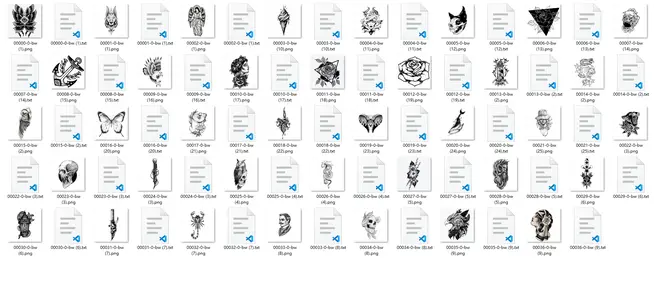
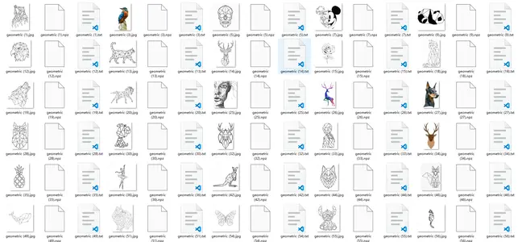
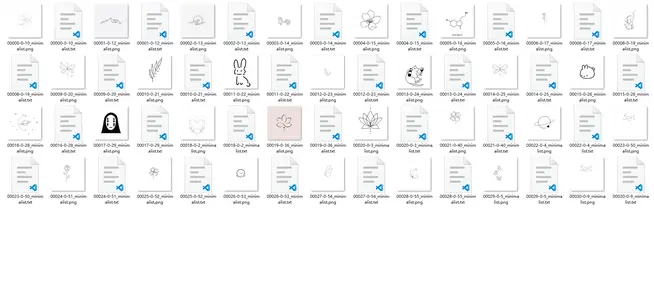

# xiaowen-sd-model

## 项目介绍

本目录为《小纹AI》统一仓库的一部分，原独立仓库为 `xiaowen-sd-model`。项目总览见 [根目录说明](../README.md)。主要内容为 Stable Diffusion 相关说明和 LoRA 训练素材；运行服务及所需模型权重需要单独准备。

- [xiaowen-wechat-miniprogram](../wechat-miniprogram/)：微信小程序前端项目
- [xiaowen-backend](../backend/)：后端项目
- [xiaowen-BMC](../admin/)：后台管理前端项目
- （当前）[xiaowen-sd-model](./)
  ：Stable diffusion 相关资源（模型、数据集等）

## 项目结构

- `LoRA-dataset/`：LoRA训练需要的数据集

 

 

